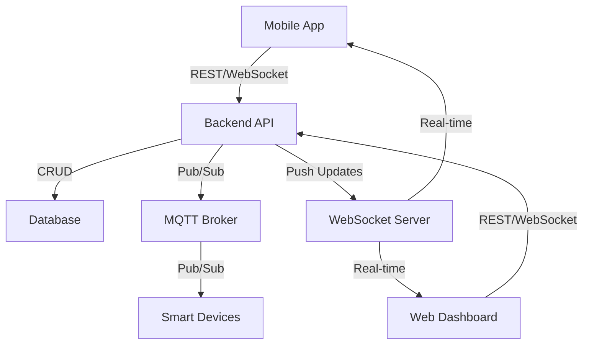

# Smart House System Architecture

## Introduction

This document outlines the complete system architecture for the Smart House System. The architecture is designed to support a comprehensive smart home ecosystem including device control, sensor monitoring, real-time alerts, automation rules, user management with roles, logging, and integration with IoT devices via MQTT. The system comprises a mobile app, web dashboard, backend API, database, WebSocket for real-time updates, MQTT broker for IoT communication, and smart devices.

## System Overview

The Smart House System enables users to monitor and control smart home devices remotely. Key features include:
- Device control (lights, thermostats, locks, etc.)
- Sensor monitoring (temperature, motion, humidity)
- Real-time alerts and notifications
- Automation rules (e.g., turn off lights at sunset)
- User roles (admin, user, guest)
- Activity logs and analytics
- Secure authentication and authorization

The architecture follows a microservices-inspired approach with clear separation of concerns, ensuring scalability, security, and real-time capabilities.

## Major Components

### 1. Mobile App
- **Responsibilities**: Provides user interface for device control, monitoring, and alerts on mobile devices (iOS/Android).
- **Interactions**: Communicates with Backend API via REST/GraphQL and WebSocket for real-time updates.
- **Technology**: Cross-platform framework for native performance.

### 2. Web Dashboard
- **Responsibilities**: Browser-based interface for comprehensive system management, analytics, and administration.
- **Interactions**: Similar to mobile app, uses Backend API and WebSocket.
- **Technology**: Responsive web application.

### 3. Backend API
- **Responsibilities**: Handles business logic, authentication, authorization, device management, automation rules, and data processing.
- **Interactions**: Serves REST/GraphQL endpoints to clients, manages database operations, publishes/subscribes to MQTT topics, and pushes WebSocket updates.
- **Technology**: Scalable server-side framework.

### 4. Database
- **Responsibilities**: Stores user data, device configurations, sensor readings, logs, automation rules, and system state.
- **Interactions**: Queried by Backend API for CRUD operations.
- **Technology**: NoSQL or relational database optimized for time-series data and scalability.

### 5. WebSocket Server
- **Responsibilities**: Enables real-time bidirectional communication for live updates (e.g., sensor changes, alerts).
- **Interactions**: Integrated with Backend API to push updates to connected clients.
- **Technology**: WebSocket library or framework extension.

### 6. MQTT Broker
- **Responsibilities**: Facilitates IoT device communication using publish/subscribe model.
- **Interactions**: Smart devices publish sensor data and subscribe to control commands; Backend API acts as client to broker.
- **Technology**: Lightweight MQTT broker.

### 7. Smart Devices
- **Responsibilities**: Physical IoT devices (sensors, actuators) that interact with the environment.
- **Interactions**: Connect to MQTT Broker for data exchange; receive commands from Backend API.
- **Technology**: Embedded systems with MQTT client capabilities.

## Technology Stack Choices

- **Backend API**: Node.js with Express.js - Chosen for its asynchronous I/O, large ecosystem (npm), and suitability for real-time applications. Supports WebSocket integration via Socket.io.
- **Database**: MongoDB - NoSQL database ideal for flexible schemas, JSON-like documents, and handling time-series sensor data. Provides scalability for growing device data.
- **Web Dashboard & Mobile App**: React.js for web (with Redux for state management) and React Native for mobile - Unified codebase, component-based architecture, and strong community support for cross-platform development.
- **WebSocket**: Socket.io - Built on WebSocket protocol, provides fallbacks and easy integration with Node.js backend.
- **MQTT Broker**: Mosquitto - Open-source, lightweight, and widely adopted for IoT applications. Supports QoS levels for reliable messaging.
- **Authentication**: JWT (JSON Web Tokens) with OAuth2 for secure user sessions and API access.
- **Deployment**: Docker containers for microservices, orchestrated with Kubernetes for scalability and load balancing.
- **Security**: HTTPS/TLS for all communications, API rate limiting, input validation, and encrypted data storage.

Rationale: The stack prioritizes JavaScript ecosystem for consistency, open-source tools for cost-effectiveness, and proven technologies for reliability in IoT and real-time systems.

## Data Flow

1. **User Interaction**: User logs in via mobile app or web dashboard, authenticated by Backend API.
2. **Device Control**: User sends command (e.g., turn on light) to Backend API, which publishes MQTT message to device. Device acknowledges via MQTT.
3. **Sensor Monitoring**: Smart device publishes sensor data to MQTT Broker. Backend API subscribes, processes, stores in Database, and pushes real-time updates via WebSocket to clients.
4. **Alerts**: Backend API evaluates rules (e.g., temperature threshold), triggers alerts, logs to Database, and notifies users via WebSocket/push notifications.
5. **Automation**: Backend API runs scheduled jobs or event-driven rules, interacting with MQTT and Database as needed.
6. **Logs**: All actions logged to Database for auditing and analytics.

## Diagrams

### High-Level Architecture Diagram (Mermaid)



### Data Flow Diagram (ASCII)

```
User Clients (Mobile/Web) <--> Backend API <--> Database
                                      |
                                      | (WebSocket)
                                      v
                               Real-time Updates

Backend API <--> MQTT Broker <--> Smart Devices
                                      ^
                                      |
                               Sensor Data / Commands
```

### Component Interaction Diagram (ASCII)

```
+----------------+     +----------------+     +----------------+
|   Mobile App   |     |  Web Dashboard |     | Backend API    |
+----------------+     +----------------+     +----------------+
        |                      |                      |
        | REST/WebSocket       | REST/WebSocket       | CRUD
        |                      |                      |
        v                      v                      v
+----------------+     +----------------+     +----------------+
| WebSocket Server|     |   Database     |     |  MQTT Broker   |
+----------------+     +----------------+     +----------------+
                                                       |
                                                       | Pub/Sub
                                                       v
                                               +----------------+
                                               | Smart Devices  |
                                               +----------------+
```

## High-Level Implementation Plan

1. **Setup Development Environment**: Install Node.js, MongoDB, Mosquitto, and development tools. Set up Docker for containerization.
2. **Implement Backend API**: Build REST endpoints for authentication, device management, and rules. Integrate WebSocket and MQTT clients.
3. **Design Database Schema**: Define collections/tables for users, devices, sensors, logs, and automations.
4. **Develop Web Dashboard**: Create React app with components for device control, monitoring, and admin panels.
5. **Build Mobile App**: Use React Native to develop cross-platform app mirroring web dashboard features.
6. **Integrate IoT**: Configure MQTT Broker, implement device firmware for MQTT communication.
7. **Add Real-Time Features**: Implement WebSocket for live updates and push notifications.
8. **Implement Security**: Add JWT authentication, HTTPS, and data encryption.
9. **Testing and Deployment**: Unit/integration tests, containerize services, deploy to cloud (e.g., AWS/Azure) with Kubernetes.
10. **Monitoring and Maintenance**: Set up logging, monitoring tools (e.g., Prometheus), and CI/CD pipelines.

## Conclusion

This architecture provides a robust, scalable foundation for the Smart House System, supporting all required features with clear component separation and modern technologies. The design emphasizes real-time capabilities, security, and ease of maintenance. Implementation should follow agile methodologies, starting with core backend and database, then building client applications and IoT integration iteratively.